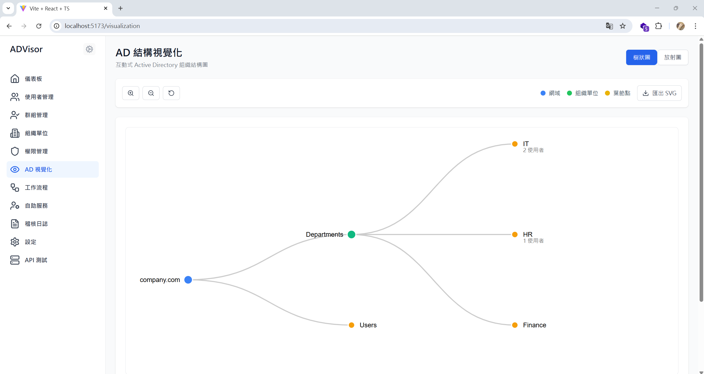
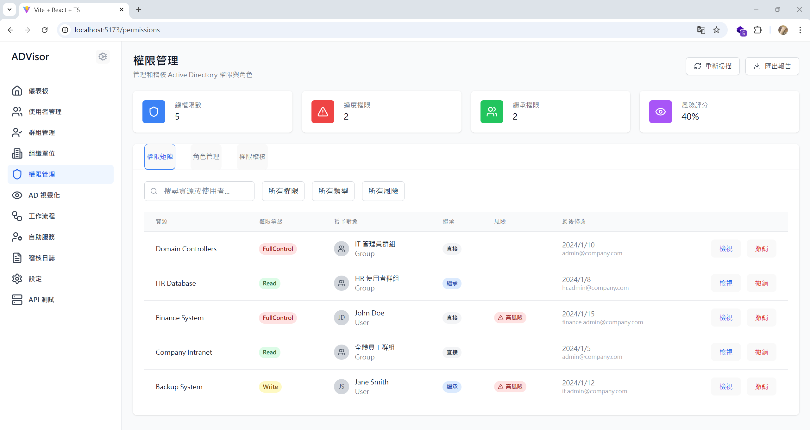

# Active Directory Visualization Management System

[](https://opensource.org/licenses/MIT)
[](https://reactjs.org/)
[](https://www.typescriptlang.org/)
[](https://vitejs.dev/)

A modern, comprehensive Active Directory management system built with React and TypeScript. ADVisor provides a complete solution for managing users, groups, organizational units, permissions, and security policies with an intuitive web interface.




## 🌟 Features

### Core Functionality
- **Dashboard** - System overview, statistics, security alerts
- **User Management** - User listing, detailed profiles, bulk operations
- **Group Management** - Security groups, distribution groups, member management
- **Organizational Units** - Tree structure display, hierarchical management
- **Permission Management** - Permission matrix, role management, risk assessment
- **Audit Logs** - Operation records, security events, compliance reports
- **Workflows** - Automated processes, approval management
- **Self-Service** - Password reset, profile updates
- **AD Visualization** - Tree diagrams, relationship graphs
- **System Settings** - AD connection, security policies configuration

### Technical Highlights
- **Frontend-Only Architecture** - No backend server required, deploy anywhere
- **Dual Mode Operation** - Supports both API connection and mock data modes
- **Responsive Design** - Works on desktop and mobile devices
- **Modern UI** - Built with Tailwind CSS
- **Type Safety** - Full TypeScript implementation
- **Real-time Updates** - Live data refresh capabilities
- **Offline Support** - Works without internet connection

## 🚀 Quick Start

### Prerequisites
- Node.js 18+
- npm or yarn

### Installation

1. **Clone the repository**
```bash
git clone https://github.com/yourusername/advicer.git
cd advicer
```

2. **Install dependencies**
```bash
npm install
```

3. **Start development server**
```bash
npm run dev
```

4. **Open your browser**
```
http://localhost:5173
```

## 📋 Operating Modes

### Mode 1: Pure Mock Data (Recommended for Demo)

This is the default mode, using frontend mock data with no backend setup required.

**Features:**
- ✅ Ready to use immediately
- ✅ Complete feature demonstration
- ✅ Safe - won't affect real systems

**Usage:**
1. Click the gear icon ⚙️ in the top right
2. Disable "Enable API Connection"
3. Reload the application

### Mode 2: API + Mock Data Fallback

Attempts to connect to real API, automatically falls back to mock data on failure.

**Features:**
- ✅ Can connect to real AD (requires backend)
- ✅ Automatic fallback ensures availability
- ✅ Perfect for testing environments
- ⚠️ Requires backend API configuration

**Usage:**
1. Ensure backend API service is running
2. Click gear icon ⚙️ to open configuration
3. Enable "API Connection"
4. Set correct API URL
5. Reload the application

## ⚙️ Configuration Options

### API Settings
- **Enable API Connection** - Whether to attempt real API connection
- **API Base URL** - Base path for API service (default: `/api`)
- **Request Timeout** - API request timeout in milliseconds
- **Auto Fallback** - Whether to fallback to mock data on API failure

### Mock Data Settings
- **Enable Mock Delay** - Simulate real API delays
- **Delay Time** - Mock delay duration in milliseconds
- **Show Warnings** - Whether to show mock data warnings in console

### Feature Toggles
- **AD Connection Test** - Enable AD connection testing functionality
- **Offline Mode** - Support offline usage

## 🏗️ Project Structure

```
src/
├── components/          # Shared components
│   ├── Layout.tsx      # Main layout
│   └── ConfigPanel.tsx # Configuration panel
├── pages/              # Page components
│   ├── Dashboard.tsx   # Dashboard
│   ├── Users.tsx       # User management
│   ├── Groups.tsx      # Group management
│   └── ...
├── services/           # Service layer
│   ├── api.ts         # API service
│   └── dataService.ts # Data service
├── config/            # Configuration
│   └── app.ts         # Application config
├── types/             # TypeScript type definitions
│   └── index.ts
└── App.tsx            # Main application
```

## 🔧 Development

### Adding New Features

1. **Create new page**
```typescript
// src/pages/NewFeature.tsx
import { useState, useEffect } from 'react';
import { dataService } from '../services/dataService';

export function NewFeature() {
  // Component logic
}
```

2. **Update routing**
```typescript
// src/App.tsx
<Route path="/new-feature" element={<NewFeature />} />
```

3. **Add navigation**
```typescript
// src/components/Layout.tsx
{ name: 'New Feature', href: '/new-feature', icon: NewIcon }
```

### Adding Mock Data

```typescript
// src/services/dataService.ts
const mockNewData = [
  // Mock data
];

export const dataService = {
  async getNewData() {
    if (!appConfig.api.enabled) {
      return mockDelay(mockNewData);
    }
    // API call logic
  }
};
```

## 🚀 Deployment

### Static Deployment (Recommended)

1. **Build the project**
```bash
npm run build
```

2. **Deploy the dist folder**
Upload the contents of the `dist` folder to any static hosting service:
- GitHub Pages
- Netlify
- Vercel
- AWS S3
- Azure Static Web Apps

### Docker Deployment

```dockerfile
FROM nginx:alpine
COPY dist /usr/share/nginx/html
EXPOSE 80
CMD ["nginx", "-g", "daemon off;"]
```

```bash
docker build -t advicer .
docker run -p 80:80 advicer
```

### GitHub Pages Deployment

1. **Enable GitHub Pages** in repository settings
2. **Use GitHub Actions** for automatic deployment:

```yaml
# .github/workflows/deploy.yml
name: Deploy to GitHub Pages

on:
  push:
    branches: [ main ]

jobs:
  deploy:
    runs-on: ubuntu-latest
    steps:
    - uses: actions/checkout@v2
    - name: Setup Node.js
      uses: actions/setup-node@v2
      with:
        node-version: '18'
    - name: Install dependencies
      run: npm install
    - name: Build
      run: npm run build
    - name: Deploy
      uses: peaceiris/actions-gh-pages@v3
      with:
        github_token: ${{ secrets.GITHUB_TOKEN }}
        publish_dir: ./dist
```

## 🔒 Security Considerations

### Mock Mode
- ✅ Completely safe, no external connections
- ✅ Won't affect real systems
- ✅ Perfect for demos and testing

### API Mode
- ⚠️ Requires proper authentication
- ⚠️ Use HTTPS in production
- ⚠️ Implement proper access controls

## 📊 Feature Showcase

### Dashboard
- User statistics
- Security alerts
- Recent activities
- System status

### User Management
- User listing and search
- Bulk operations
- Detailed profile views
- Group membership relations

### Group Management
- Security and distribution groups
- Member management
- Permission views
- Statistical information

### Permission Management
- Permission matrix
- Risk assessment
- Over-privileged account detection
- Compliance reporting

## 🛠️ Built With

- **React 18** - Frontend framework
- **TypeScript** - Type safety
- **Tailwind CSS** - Styling
- **Vite** - Build tool
- **React Router** - Routing
- **Lucide React** - Icons
- **D3.js** - Data visualization

## 📈 Roadmap

- [ ] Real-time notifications
- [ ] Advanced analytics
- [ ] Mobile app
- [ ] Multi-language support
- [ ] Plugin system
- [ ] LDAP integration
- [ ] SSO support

## 🤝 Contributing

Contributions are welcome! Please feel free to submit a Pull Request.

1. Fork the project
2. Create your feature branch (`git checkout -b feature/AmazingFeature`)
3. Commit your changes (`git commit -m 'Add some AmazingFeature'`)
4. Push to the branch (`git push origin feature/AmazingFeature`)
5. Open a Pull Request

## 📄 License

This project is licensed under the MIT License - see the [LICENSE](LICENSE) file for details.

## 📞 Support

If you have any questions or issues:
1. Check the documentation
2. Search existing issues
3. Create a new issue

## 🙏 Acknowledgments

- React team for the amazing framework
- Tailwind CSS for the utility-first CSS framework
- All contributors who help improve this project

---

**Note:** This is a demonstration management system. Please ensure proper security measures and authentication are implemented before using in production environments.

## 📸 Screenshots

### Dashboard


### User Management


### Group Management


### AD Visualization


---

Made with ❤️ by [Your Name]
